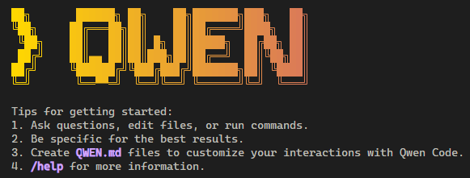
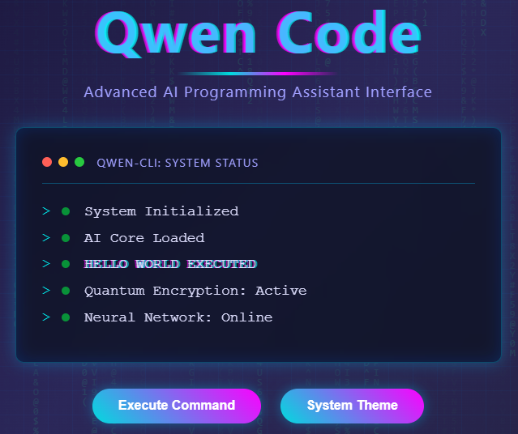

# 🚀 Qwen CLI (Qwen Code)



## 📖 專案介紹

阿里巴巴強勢推出基於 **Gemini CLI** 架構打造的 AI 程式設計代理工具 —— **Qwen Code**！🎉

本工具核心搭載旗艦級 **Qwen3-Coder** 模型，擁有強大的超長上下文處理能力，能深入理解複雜的大型軟體專案。它在以下領域表現尤為出色：

*   🧐 **程式碼審查 (Code Review)**
*   🔧 **自動重構 (Auto Refactoring)**
*   🏗️ **架構分析 (Architecture Analysis)**

此外，Qwen Code 整合了**增強型解析器**，能為開發者提供更即時、精確的程式碼理解與建議，助您大幅提升程式設計效率與程式碼品質！⚡

---

## 🔗 相關連結

*   **GitHub 儲存庫**: [QwenLM/qwen-code](https://github.com/QwenLM/qwen-code) 🐙
*   **官方網站**: [chat.qwen.ai](https://chat.qwen.ai/) 🌐

---

## 📚 專案文檔與 Agent 指南

本專案包含以下重要文件，供開發者與 AI Agent 參考：

*   **🤖 [AGENTS.md](.opencode/rules/AGENTS.md)**: 專為 OpenCode Agent 設計的專案開發指南與規則庫（OpenCode 官方標準檔案）。
*   **🧠 [QWEN.md](./QWEN.md)**: Qwen Code 專案的核心背景、架構與技術細節說明。
    *   🇹🇼 **[QWEN_zh-TW.md](./QWEN_zh-TW.md)**: `QWEN.md` 的繁體中文翻譯版本。
*   **💎 [GEMINI.md](./GEMINI.md)**: Gemini Agent 專屬的開發指南與最佳實踐。

---

## 🛠️ 安裝說明

請確保您的環境已安裝 **Node.js 20** 或更高版本。

```bash
# 安裝最新版 Qwen Code
npm install -g @qwen-code/qwen-code@latest

# 檢查版本
qwen --version
```

## 🚀 執行方式

在終端機輸入以下指令即可開始使用：

```bash
qwen
```

## �️ 技術介面展示 (Tech Interface Demo)

本專案包含一個名為 `hello_world_tech.html` 的前端展示頁面，用於呈現 **Qwen Code** 的品牌形象概念。

*   **功能與目的**：作為 "Hello World" 概念展示或未來的登陸頁面範本。
*   **視覺特效**：
    *   🌌 **動態背景**：包含 Matrix 代碼雨與深邃宇宙風格。
    *   ⚡ **故障藝術 (Glitch)**：標題與終端機文字帶有數位雜訊效果。
    *   🎨 **主題切換**：支援高對比的「庫柏紅 (Cyber Red)」與「科技藍 (Tech Blue)」雙色主題切換。
*   **技術架構**：採用 HTML/CSS/JS 分離架構 (`style.css`, `script.js`)，確保代碼整潔與可維護性。

您可以用瀏覽器直接打開 `hello_world_tech.html` 體驗這些效果。

## �📸 實機演示 (Demo)

